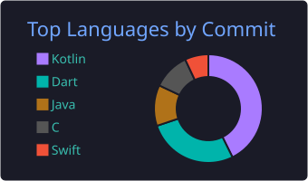

  # Hi there, I'm Alaa Hany ElGebaly 👋

  

  

    <strong>Mobile Application Developer</strong> specializing in <strong>Native Android (Kotlin & Jetpack Compose)</strong> and <strong>Cross-Platform (Flutter & Dart)</strong>, building clean, scalable, and AI-powered mobile experiences.
  

  

    
    
    
  

---

### 🚀 About Me

- 🌐 **Interactive Portfolio:** [https://alaa7hany.github.io](https://alaa7hany.github.io)
- 🎓 **Postgraduate Diploma:** 9-Month Professional Diploma in Mobile Applications Development (Native) from **Information Technology Institute (ITI)**.
- 🎓 **Degree:** B.Sc. in Computer & Systems Engineering from **Zagazig University** (*Very Good with Honors*).
- 💡 **Core Specialization:** Modern Android Development (Kotlin, Jetpack Compose, Coroutines & Flow, Room DB, Retrofit, Apollo GraphQL, Clean Architecture & MVI/MVVM).
- ⚡ **Cross-Platform & Native iOS:** Flutter (BLoC/Cubit), Kotlin Multiplatform (KMP), and Swift (UIKit/SwiftUI).
- 🤖 **AI & Integrations:** Multimodal AI SDKs (Google Gemini), Agentic AI workflows (n8n, Groq), Shopify Storefront GraphQL, and Payment Gateways (Paymob, Stripe).
- 🛠️ **DevOps Foundations:** Certified DevOps Engineer (DEPI) with experience in Docker, Jenkins CI/CD, Terraform, and Kubernetes.

---

### 🛠️ Tech Stack & Tooling

#### 📱 Mobile & Android Native

#### 🌐 Cross-Platform & iOS

#### 🧠 AI, APIs & Backend

#### ⚙️ DevOps, Cloud & Tools

---

### ⭐ Featured Projects

| Project | Tech Stack | Highlights |
| :--- | :--- | :--- |
| **[LinguaQuest](https://github.com/LinguaQuest-AI-Powered/LinguaQuest-Android-App)**   [🎥 **Video Demo**](https://youtu.be/SQ8NBcGwBbM) | `Kotlin` • `Compose` • `Gemini AI` • `CameraX` • `MVI` | AI-powered real-world scavenger hunt app featuring live camera object recognition, interactive AI roleplay, and offline Room DB caching. |
| **[Qafilah](https://github.com/Sian1902/Qafilah)** | `Kotlin` • `Compose` • `Shopify GraphQL` • `n8n AI` • `Paymob` | Next-gen AI mobile commerce app with Shopify Storefront GraphQL, Paymob payment checkout, and Agentic AI recommendations. |
| **[Pip-Boy Weather Station](https://github.com/Alaa7Hany/MAD46_Pip-Boy)** | `Kotlin` • `Compose` • `WorkManager` • `Google Maps` • `Room` | Retro-futuristic weather app featuring live radar, interactive map location picking, and automated background weather alerts. |
| **[Taier](https://github.com/MetoIsTheKing/Graduation-Project-2025)** | `Flutter` • `BLoC` • `Stripe SDK` • `AI Chatbot` • `Dio` | Smart flight booking graduation project (*Grade: Excellent*) with multi-city route search, dynamic pricing, Stripe payment, and AI chatbot. |
| **[MessageMe](https://github.com/Alaa7Hany/MessageMe)** | `Flutter` • `Cubit` • `Firebase Suite` • `FCM` • `Storage` | Real-time messaging application with 1-on-1/group chats, live presence indicators, push notifications, and Remote Config. |
| **[League Lens (Sports)](https://github.com/Alaa7Hany/MAD46_Sports)** | `Swift` • `UIKit` • `MVP` • `CoreData` • `Alamofire` | Native iOS sports tracking app displaying live league standings, match fixtures, offline favorites persistence via CoreData, and Lottie animations. |

---

### 📊 GitHub Stats & Activity

  
  

---

  
<em>"Building high-impact mobile solutions with clean architecture and delightful user experiences."</em>

  
© 2026 Alaa Hany ElGebaly

